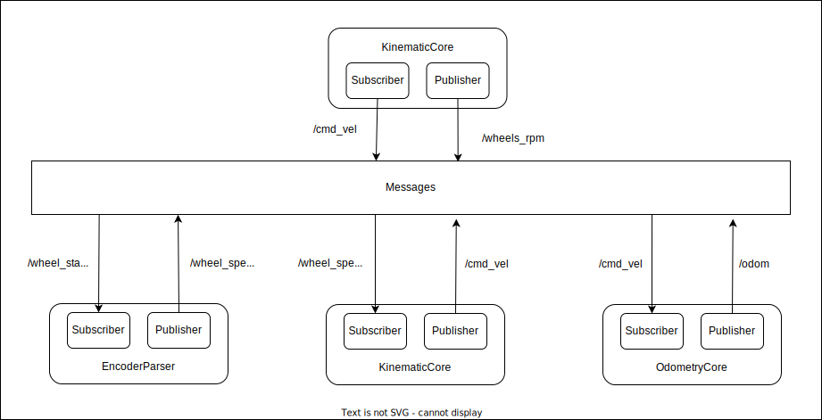

# ROS ~ Robotics course's first project
Politecnico di Milano - Accademic Year 2021-2022

>### Team
>* [__Elia Maggioni__](https://github.com/Eliaxie)
>* [__Flavio Renzi__](https://github.com/FlavioRenzi)
>* [__Jaskaran Singh__](https://github.com/zJaska)

The whole project was implemented utilizing `ROS Noetic` on a `Linux Ubuntu 20.04` machine.

## Goals
- Compute odometry using appropriate kinematics:
    - Compute robot linear and angular velocities v, ⍵ from wheel encoders.
    - Compute odometry using both Euler and Runge-Kutta integration.
    - ROS parameter for initial pose.
    - Calibrate (fine-tune) robot parameters to match ground truth.
- Compute wheel control speeds from v, ⍵.
- Add a service to reset the odometry to a specified pose (x,y,θ).
- Use dynamic reconfigure to select between integration method.

##
> To see the complete requirements -> [Project presentation](Project1.pdf)


## Package content
- bags: directory containing the supplied bags.
- cfg: directory containing the python file for dynamic reconfigure the integration type.
- launch: directory containing the launch-file that run the necessary nodes and set the initial parameter (initial coordinates and robot dimensions)
- msg: contain the file which define the custom message to pubblish the wheel speed.
- src: contain the node code in c++.
- srv: directory containing the files to define the 2 custom services to set or reset the position in the odometry.
- rviz.rviz: config file to see the robot odometry.

## Nodes

- EncoderParser: reads the tick from the encoder and compute the speed of each wheel publishing it in the custom message.
- KinematicCore: reads the wheel speed and compute the kinematic of the robot in each axis.
- OdometryCore: 
this node is used to compute the odometry of the robot, to publish all the related messages and to expose two services to set the position.
The node reads the messages published by KinematicCore node and, based on the value of the param "integration",
it computes the odometry of the robot using Euler or Runge-Kutta integration. After this it publishes the odometry on a topic and publishes the tf transformation.
For the integration type, the node uses the dynamic reconfigure to set the integration type; the default value is "Euler"
and whenever the user changes the param a callback is executed, changing the value of the field "integrationType" of the class `Pub_Sub_Odometry_core`.
The node exposes also two callbacks for the two services: `resetZero`, that set the x and y positions to 0 when the user calls the service;
and `resetGeneral`, that set the pose of the robot equal to the value x, y and theta that the user passes when calls the service.
The node read the initial pose of the robot from the params declared in the launch file and sets the x, y and theta of the robot.
- ReverseKinematicCore: reads the speed of the robot and calculates the speed at wich each wheel needs to go to obtain that movement.


## Parameters
In the launch file there is the possibility to tune the parameters depending on the robot geometry:
- Largh
- Lungh
- WheelRad

and to set the initial position:
- InitialX
- InitialY
- InitialTheta

without having to recompile the code.

## TF tree
Our tf tree is composed of three transformation frames (world, odom and base_link):
- a static transformation links the world frame to the odom frame, the relation is thought in order to match the position of the data in the bags if necessary.
- the transformation between odom and base_link is the one responsible for the real localization of the robot in the space

## Custom message
- WheelSpeed: encodes the wheels rpm as specified in the assignment.

## How To Run

In this file you can also set the link between world and odom frame using static transformation.
The provided command will run all the nodes specified in the launch file and a precofigured rviz to look at the robot movement.

```console
$ roslaunch RoboticsProject main.launch
```

## ToDo
- [x] create launch file with parameter
- [x] compute real wheels speed from wheels position
    - [x] custom message to pubblish the speed `WheelSpeed`  on topic `wheel_speed`
- [x] compute kinematic to obtain the speed of the robot
    - [x] publish speed on topic `cmd_vel` with a message of type `geometry_msgs/TwistStamped`
- [x] compute integration to obtain the position of the robot
    - [x] enumeration for the 2 integration methods
    - [x] add ROS parameter for initial position
    - [x] publish speed on topic `odom` with a message of type `nav_msgs/Odometry`
    - [x] Broadcast TF `odom->base_link`
- [x] compute inverse kineamtic from the speed of the robot to obtain the speed of the wheels
    - [x] custom message to publish the speed `WheelSpeed` on topic `wheels_rpm` 
- [x] tune parameter
- [x] create a service to reset the position to a given one
- [x] fix name in the diagrams
- [ ] add reference material


